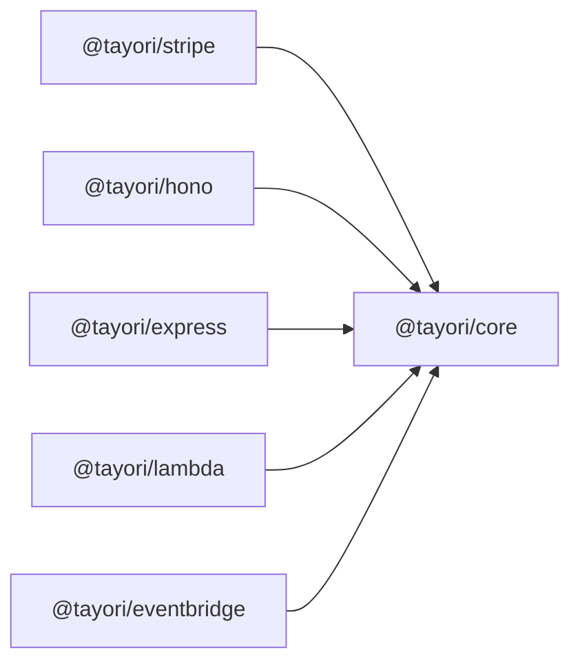

Tayori is a Hono-inspired, type-safe webhook routing library for TypeScript. Originally built for Stripe webhooks, it has evolved into a framework-agnostic webhook handling solution that works with any event source.

## Key characteristics

- **Type-safe webhook routing** — Full TypeScript support with generic event type definitions
- **Framework-agnostic core** — Core routing logic has zero framework dependencies
- **First-class Stripe support** — 351+ Stripe event types with full type inference
- **Monorepo structure** — Multiple packages for core, adapters, and tooling
- **Node.js >= 18** — Modern runtime support

## Architecture

Tayori follows an **adapter pattern**: the core package (`@tayori/core`) contains all routing logic and has no framework dependencies. Framework-specific packages (Hono, Express, Lambda, EventBridge) wrap the core and expose it for their environment.

## Design principles

1. **Type safety first** — All events are fully typed using generics
2. **Framework-agnostic core** — Core has zero framework dependencies
3. **Adapter pattern** — Framework integrations wrap the core
4. **Chainable API** — Hono-inspired fluent interface for registering handlers
5. **Pluggable verification** — Bring your own verifier for any webhook provider
6. **Runtime validation** — Optional Zod integration for schema validation

## Next steps

- [Installation](/getting-started/installation/) — Install Tayori and choose your adapter
- [Stripe Webhooks](/guides/stripe-webhooks/) — Set up Stripe webhooks with type safety
- [Custom Webhooks](/guides/custom-webhooks/) — Use Tayori with any webhook provider
